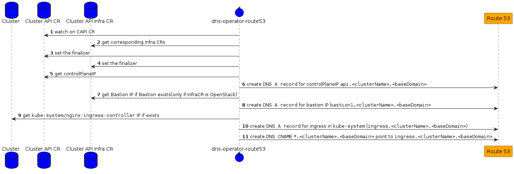

# dns-operator-route53

`dns-operator-route53` is a controller, which runs once per management Cluster. It's responsible for creating the following DNS Records per `cluster`:

* `A`: `api.<clustername>.test.gigantic.io` (points to the kubernetes API IP of a `cluster`)
* `A`: `bastion1.<clustername>.test.gigantic.io` (points to the bastion Host IP of a `cluster` - only on `OpenStack` yet)
* `A`: `ingress.<clustername>.test.gigantic.io` (points to `kube-system/nginx-ingress-controller`)
* `CNAME`: `*.<clustername>.test.gigantic.io` for `ingress.<clustername>.test.gigantic.io`

## reconciliation loop



Even there is no need at all to set the finalizer `dns-operator-route53.finalizers.giantswarm.io` on some `infrastructureProviders` but to keep the
behavior as equal as possible over different `infrastructureProviders` we do so.

### new infrastructure provider

- [ ] extend RBAC by adapting `infraCluster` function in `_helpers.tpl` file.
- [ ] if the new `infrastructureProvider` has the concept of a bastion host, extend the `BastionIP` method of `ClusterScope` to extract.

### known issues

- better error handling during cluster creation/deletion
  we currently get a bunch of `ERRORs` during cluster creation/deletion which we didn't catch up correctly. Due the reconciliation it took some iterations once we don't get any new errors on a cluster base.
  ```
  [...]
  1.6590013590095057e+09  ERROR   controller.cluster      error creating route53  {"reconciler group": "cluster.x-k8s.io", "reconciler kind": "Cluster", "name": "ssmcj", "namespace": "org-single-gs3", "error": "Get \"https://216.119.153.186:6443/api?timeout=32s\": EOF"}
  github.com/giantswarm/dns-operator-route53/controllers.(*ClusterReconciler).Reconcile
          /workspace/controllers/cluster_controller.go:98
  [...]
  ```

### understanding route53 created resources

By using the `aws` cli it's sometimes helpful to get the current created Route53 entries.

* `list-hosted-zones` to get all known zones (zone per MCs/WCs)

  e.g. `aws route53 list-hosted-zones`
  
  ```json
  [...]
          {
              "Id": "/hostedzone/Z03125952PEGL48P3XXXX",
              "Name": "<clustername>.test.gigantic.io.",
              "CallerReference": "2022-02-28 13:18:58.314893351 +0000 UTC",
              "Config": {
                  "Comment": "management_cluster: <management_cluster_name>",
                  "PrivateZone": false
              },
              "ResourceRecordSetCount": 5
          },
  [...]
  ```

* `list-resource-record-sets` to get all registred DNS records per zone

   e.g. `aws route53 list-resource-record-sets --hosted-zone-id /hostedzone/Z03125952PEGL48P3XXXX`
   ```json
   {
       "ResourceRecordSets": [
           {
               "Name": "<clustername>.test.gigantic.io.",
               "Type": "NS",
               "TTL": 172800,
               "ResourceRecords": [
                   {
                       "Value": "ns-360.awsdns-45.com."
                   },
                   {
                       "Value": "ns-1836.awsdns-37.co.uk."
                   },
                   {
                       "Value": "ns-1002.awsdns-61.net."
                   },
                   {
                       "Value": "ns-1027.awsdns-00.org."
                   }
               ]
           },
           {
               "Name": "<clustername>.test.gigantic.io.",
               "Type": "SOA",
               "TTL": 900,
               "ResourceRecords": [
                   {
                       "Value": "ns-360.awsdns-45.com. awsdns-hostmaster.amazon.com. 1 7200 900 1209600 86400"
                   }
               ]
           },
           {
               "Name": "\\052.<clustername>.test.gigantic.io.",
               "Type": "CNAME",
               "TTL": 300,
               "ResourceRecords": [
                   {
                       "Value": "ingress.<clustername>.test.gigantic.io"
                   }
               ]
           },
           {
               "Name": "api.<clustername>.test.gigantic.io.",
               "Type": "A",
               "TTL": 300,
               "ResourceRecords": [
                   {
                       "Value": "216.119.100.100"
                   }
               ]
           },
           {
               "Name": "ingress.<clustername>.test.gigantic.io.",
               "Type": "A",
               "TTL": 300,
               "ResourceRecords": [
                   {
                       "Value": "216.119.100.101"
                   }
               ]
           }
       ]
   }
   ```